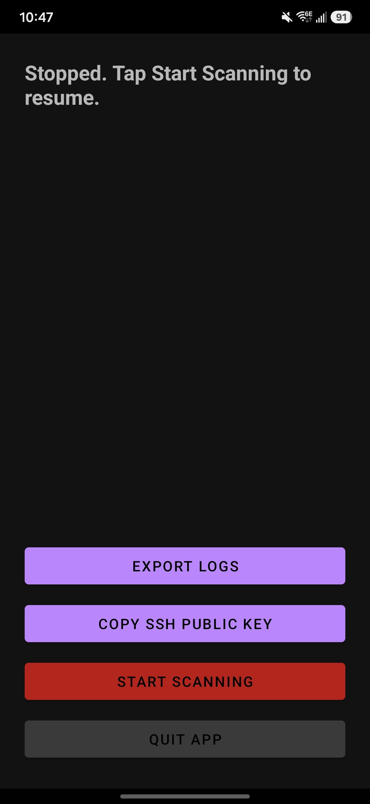

# Car Monitor

[](https://github.com/howardkim0/car_monitor/actions/workflows/coverage.yml)
[](https://github.com/howardkim0/car_monitor/actions/workflows/release-apk.yml)

An Android app that sits in the background, maintains a Bluetooth connection
to a car's OBD2 scanner (ELM327-compatible dongle), continuously pulls
vehicle data (RPM, speed, coolant temp, fuel trims, etc.), logs it locally,
and flags trend-based anomalies (overheating, charging system issues,
catalytic converter failure, and more). Core logic is written in Go and
compiled into the app via `gomobile`; a thin Kotlin shell owns Bluetooth I/O
and the Android foreground service.

For the full architecture, extensibility points, and design rationale, see
**[DESIGN.md](DESIGN.md)** — this README only covers getting the app running.



## Install

The simplest way to try it: grab the latest debug-signed APK, built from
`main` on every push:

```sh
gh release download latest -p 'car-monitor-debug.apk' -R howardkim0/car_monitor
adb install -r car-monitor-debug.apk
```

Or download `car-monitor-debug.apk` from the [Releases
page](../../releases) directly and install it on-device. See
[docs/dev-setup.md](docs/dev-setup.md) for signing details.

## Build from source

```sh
# One-time: install the pinned Go/JDK/Android SDK/NDK toolchain
./scripts/setup_ubuntu.sh

# Build the Go core into an Android AAR, then the app
cd go/mobile && gomobile bind -androidapi 26 -o ../../android/app/libs/mobile.aar -target=android ./...
cd ../../android && ./gradlew assembleDebug

# Install on a connected device
adb install -r app/build/outputs/apk/debug/app-debug.apk
```

See [docs/dev-setup.md](docs/dev-setup.md) for what each prerequisite is
for and why the build is split this way.

Once installed, the app connects to a hardcoded ELM327 dongle MAC address
and vehicle profile (v1 targets a 2023 Subaru Forester) — see [DESIGN.md
§5](DESIGN.md#5-extensibility) for how to point it at a different device or
car. On first launch, exempt the app from battery optimization when
prompted, or background monitoring will be killed by Android after a while.

## Repo layout

- `go/` — all business logic (OBD2 protocol, device/vehicle profiles,
  storage, trend detection, git backup, SSH keys), a plain Go module with a
  100%-enforced test coverage floor.
- `android/` — the Kotlin shell: Bluetooth I/O, the foreground service,
  permissions, and the single status screen.
- `docs/` — local build/test setup (`dev-setup.md`), a log of past bugs
  (`defects.md`), tracked future work (`open-questions.md`),
  implementation plans for non-trivial features (`plan-*.md`),
  screenshots, and the CI-generated coverage badge.
- `scripts/setup_ubuntu.sh` — installs/updates the full local build
  toolchain.

## Development

Tests and formatting are enforced by `githooks/pre-commit` on every commit
(`gofmt`, `go vet`, `go test ./...` with 100% coverage, `go build ./...`),
set up automatically by `scripts/setup_ubuntu.sh`. See
**[CLAUDE.md](CLAUDE.md)** for this repo's contribution conventions —
design-doc-first changes, regression tests for every bug fix, and the
two-persona review this codebase is held to.

Android tests run separately via `./gradlew testDebugUnitTest` (JUnit +
Robolectric + MockK); see [DESIGN.md
§10](DESIGN.md#10-testing-philosophy) for why `android/` isn't held to
the same 100% coverage bar as `go/`, and
[docs/dev-setup.md](docs/dev-setup.md) for the tooling itself.
