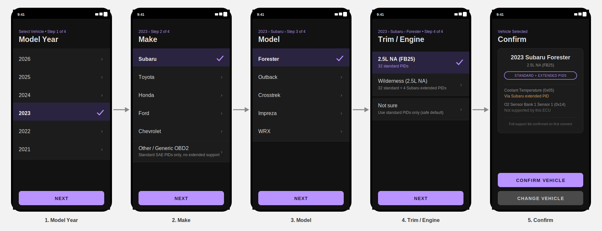

# Plan: Multi-Vehicle Support (Brand-Specific Extended PIDs)

> Saved per `CLAUDE.md`'s "Planning docs go in docs/". Proposal, not yet
> approved for implementation — fleshes out
> [#2](../../../issues/2) ("Vehicle selection has no in-app UI") from
> `docs/open-questions.md` into a concrete design. Nothing here has been
> built; `internal/vehicle` today still has exactly one hardcoded
> `Profile` (`vehicle.Default()`, `DESIGN.md` section 5.2).

## 1. Motivation

This session's investigation into `internal/trend` (see
`docs/defects.md`'s "Trend / anomaly detection" section) decoded the
real Subaru Forester's OBD2 discovery response byte-for-byte and
confirmed its ECU does not expose standard SAE J1979 PID `0x05`
(Coolant Temperature) or `0x14` (O2 Sensor Bank 1 Sensor 1) over generic
Mode 01 at all — not a bug in this app's discovery code, a genuine
capability the ECU itself declines. `CheckCoolantTemp` and
`CheckCatalyticConverter` (`internal/trend`) are consequently dead code
for this vehicle: they never run, because `internal/monitor.Evaluate`'s
`len(series) > 0` guards never pass.

Manufacturers commonly *do* expose the equivalent data — coolant temp
especially — just through a proprietary PID under Mode 22 ("read data
by identifier") instead of the standard Mode 01 PID. Recovering that
data means:

1. Supporting more than one vehicle at all (today's `vehicle.Profile`
   is a single hardcoded value — `DESIGN.md` section 5.2 already notes
   "a second car is an additive `Profile` value," but nothing exercises
   that claim yet).
2. Supporting *manufacturer-specific* PIDs, which need a different
   request mode, a wider identifier, and a bespoke decode formula per
   manufacturer (sometimes per model/model-year) — Mode 22 responses
   aren't standardized the way Mode 01's are.
3. Giving the user a way to tell the app which vehicle they have, since
   none of this can be inferred from the adapter alone the way Mode 01
   PID-support discovery is.

This doc addresses all three, expanding `vehicle.Profile` from a single
hardcoded struct into a small per-vehicle registry, adding a `Mode 22`
extended-PID path alongside the existing Mode 01 one, and proposing an
in-app selection UI.

## 2. Prior art: how other OBD2 apps do this

Surveyed the vehicle-selection UX of the well-known consumer OBD2 apps
(Torque, Car Scanner ELM327, OBD Fusion, Carista) for pattern
consistency rather than inventing a new convention:

- All of them use a **drill-down of Year → Make → Model → (Engine/Trim)**
  as the manual path, exactly as described in this request. Each step
  narrows the list to only combinations that exist (e.g. selecting
  "2023" then "Subaru" only offers models Subaru actually sold in
  2023), which is also how discovery cost stays low here — no PID
  querying happens until a profile is chosen.
- Trim/engine is usually the *last*, often optional, step — only shown
  when a Make/Model/Year has more than one meaningfully different PID
  set (different engine, different extended-PID support). Single-
  variant vehicles skip straight to confirmation.
- Several (Torque, Car Scanner) also **auto-decode the VIN** (Mode 09
  PID `0x02`, itself a standard Mode 01-family request this app's
  `obd2` package could add cheaply) to pre-fill or entirely skip manual
  selection, falling back to the manual drill-down when VIN decode
  fails or is ambiguous. This is called out in section 7 as a
  worthwhile future enhancement, but the request here is specifically
  the manual drill-down/dropdown flow, so VIN decode is out of scope
  for this proposal's Phase 1/2.
- A "Generic / Other" escape hatch that falls back to standard-PID-only
  behavior is universal — nobody requires an exact vehicle match before
  the app is usable at all. This app already effectively has that
  fallback as its *only* behavior today (`vehicle.Default()`), so it's
  preserved here as an explicit option rather than removed.

## 3. Proposed UX

Five screens: four drill-down steps plus a confirmation summary. Mirrors
the existing device-picker screen's visual language (`DESIGN.md`
section 5.1, dark theme, purple accent buttons, full-width list rows) —
no new visual system introduced.



1. **Model Year** — a plain scrollable list, newest first, back to 1996
   (the US OBD2 mandate year; nothing before that is in scope). No
   dropdown-vs-list distinction in practice for this step since the
   full range is always shown.
2. **Make** — filtered to makes with at least one `Profile` entry for
   the chosen year, plus the "Other / Generic OBD2" escape hatch always
   listed last, visually separated, explicitly labeled with what it
   means ("standard SAE PIDs only, no extended support") so the
   tradeoff is visible before picking it, not discovered later.
3. **Model** — filtered to that Make's models for that year.
4. **Trim / Engine** — only shown when the Make/Model/Year combination
   has more than one `Profile` variant (see section 4's `Trim` field);
   skipped straight to confirmation otherwise. Always includes a "Not
   sure" option that resolves to the variant with the smallest common
   PID set (i.e. standard-only), never to one with extended PIDs the
   user didn't confirm — picking the wrong *narrower* profile costs
   missing data; picking the wrong *wider* one risks garbage decoded
   from a manufacturer PID that doesn't mean what the profile assumes.
5. **Confirm** — summary card (make/model/year/trim, which PID tiers
   apply) plus, once a live connection has actually run discovery, which
   specific PIDs from the profile the ECU confirmed vs. didn't (the
   mockup's "Via Subaru extended PID" / "Not supported by this ECU"
   rows) — reusing `obd2.Session`'s existing discovery-resolution data
   (`DESIGN.md` section 5.2), not a new discovery mechanism. Before a
   first connection, this section reads "confirmed on first connect"
   instead of asserting support it hasn't verified yet.

Back navigation at each step preserves prior selections (standard
Android back-stack behavior, no new state machine needed beyond what
each step's dropdown/list already holds).

## 4. Data model: `internal/vehicle`

Today:

```go
type Profile struct {
    Make, Model string
    Year        int
    PIDs        []PID
}

func Default() Profile { return subaruForester2023 }
```

Proposed:

```go
type Profile struct {
    Make, Model string
    Year        int
    Trim        string // "" when the Make/Model/Year has only one variant
    PIDs        []PID
}

// registry replaces the single hardcoded profile. Adding a vehicle is
// purely additive — append a Profile value, no changes to obd2 or
// Kotlin (DESIGN.md section 5.2's existing extensibility promise,
// exercised here for the first time by more than one entry).
var registry = []Profile{
    subaruForester2023,
    subaruForester2023Wilderness,
    // ...
}

func Available() []Profile { return registry }

// Default is unchanged in behavior for existing callers/tests: still
// the Forester, now registry[0] instead of the only value that exists.
func Default() Profile { return registry[0] }
```

`PID` needs an extended-PID path alongside the existing Mode 01 one:

```go
type Mode byte

const (
    ModeCurrentData Mode = 0x01
    ModeExtended    Mode = 0x22 // manufacturer-specific "read data by identifier"
)

type PID struct {
    Code   uint16 // was byte — Mode 22 identifiers are two bytes (e.g. Subaru's are 0x1990-range)
    Mode   Mode
    Name   string
    Unit   string
    Decode func(data []byte) (float64, error)
}
```

Widening `Code` from `byte` to `uint16` is the one change that ripples
outside `vehicle`: `internal/obd2`'s discovery bitmask logic
(`tryHandleDiscoveryResponse`, `discoveryRanges`) is Mode-01-specific by
design already (`DESIGN.md` section 5.2, "only covers Mode 01") and
stays that way — Mode 22 PIDs are simply excluded from the discovery
bitmask walk and requested directly, unconditionally, the way Mode 01
PIDs were *before* discovery existed. If the ECU doesn't actually
support a given Mode 22 identifier it returns a negative response
(`7F 22 ...`) or times out, which `obd2` already tolerates as ordinary
noise — no new failure path, just a request that goes unanswered.

## 5. Selection & persistence

Mirrors `device.SelectedOrDefault`/`SaveSelected`/`LoadSelected`
(`DESIGN.md` section 5.1) exactly, since that pattern already solves
"one hardcoded fallback, overridable by a persisted user choice":

```go
// internal/vehicle/vehicle.go
func SelectedOrDefault(dir string) Profile
func SaveSelected(dir string, p Profile) error
func LoadSelected(dir string) (Profile, bool, error)
```

Same plain-text-file philosophy as the device selection and
`internal/applog` (`DESIGN.md` section 6.2) — no new storage mechanism.
JNI wrappers follow the existing `mobile.DeviceMAC`/`SetSelectedDevice`
naming: `mobile.VehicleProfile(storageDir)` /
`mobile.SetSelectedVehicle(storageDir, make, model, year, trim)`.

`internal/obd2.Session` already takes a `vehicle.Profile` at
construction and never sees a literal PID list otherwise — selecting a
different vehicle is exactly as isolated a change as selecting a
different device already is.

## 6. Where profiles live (open question, not blocking)

Registry-in-Go (a slice literal, like today's single `subaruForester2023`)
is proposed for Phase 1: zero new infrastructure, matches how the
existing profile is defined, and keeps profiles under the same 100%
Go-test-coverage bar as the rest of `internal/vehicle`. `DESIGN.md`
section 5.3 already flags a bundled JSON/YAML asset as a later option
once editing profiles without a rebuild matters (e.g. community-
contributed extended-PID definitions) — not needed to ship Phase 1, and
deliberately deferred rather than built speculatively.

## 7. Phasing

1. **Phase 1 — registry + manual UI, standard PIDs only.** Multiple
   `Profile` entries (different Make/Model/Year/Trim), all still Mode
   01/standard SAE PIDs exactly like today's Forester profile. Ships
   the full 5-screen UX from section 3. Delivers value on its own: even
   without a single extended PID, more vehicles get an *accurate*
   standard-PID list (a Make/Model this app has never seen might
   support PIDs the current one-size-fits-all Forester profile doesn't
   list, or vice versa).
2. **Phase 2 — Mode 22 extended PIDs.** Add the `Code uint16`/`ModeExtended`
   support from section 4, starting with Subaru's coolant-temp
   equivalent (the concrete gap that motivated this doc) once a real
   identifier + decode formula is confirmed against hardware — not
   guessed from documentation alone, per this repo's general "verify
   against real hardware" bias (`docs/open-questions.md`'s `ATZ`/`InitCommands`
   entry is the precedent).
3. **Phase 3 (future, not this doc's scope) — VIN auto-decode.** Mode 09
   PID `0x02` read plus a decode step, to pre-fill or skip the manual
   flow. Additive on top of Phases 1-2; the manual drill-down remains
   the fallback either way, so it's not a prerequisite for shipping it.

## 8. Risks / open questions

- **Reverse-engineering manufacturer PIDs is per-vehicle effort with no
  shortcut** — Mode 22 identifiers and their decode formulas aren't
  published the way SAE J1979's are; each one needs either a factory
  service manual reference or hardware verification. This is the real
  cost driver for Phase 2, not the code change itself.
- **Trim ambiguity when the user genuinely doesn't know their engine
  variant.** Handled by "Not sure" resolving to the narrowest
  (standard-only) profile (section 3, step 4) rather than guessing wide.
- **Testing new profiles without owning the vehicle.** Phase 1 profiles
  (standard PIDs only) are low-risk to add speculatively since they're
  just SAE J1979, the same PIDs already validated against the real
  Forester. Phase 2 extended-PID profiles should not be added without a
  way to verify them (either the contributor's own hardware, or a
  documented factory reference) — same bar as `docs/open-questions.md`'s
  unverified-`InitCommands` entry.
- **This doc doesn't cover DTC read/clear** (`docs/open-questions.md`
  [#3](../../../issues/3)) even though manufacturer-specific DTCs are a
  related, similarly per-vehicle problem — kept out of scope here to
  avoid conflating two different future features.
